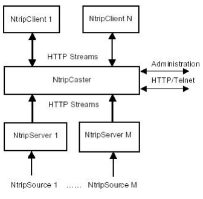

**Welcome to the Open NTRIP Caster Project**
The goal of this project is to provide a free and open source NTRIP Caster software for distributing GNSS RTK correction data.
This software allows agriculture company alliances to provide their customers with automatic RTK-station roaming, almost unlimited number of users per RTK Station and more.

To connect your GNSS RTK station to the caster, simply edit the "NTRIP Server" settings of your RTK station so that it connects to the NTRIP Caster and uploads the correction data.

This project is based on the work of [Lance ("Lefebure")](http://lefebure.com/software/ntripcaster/) and the initial [NTRIP development-efforts](http://software.rtcm-ntrip.org/) of the German Government. 

